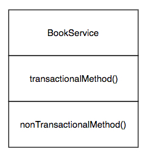
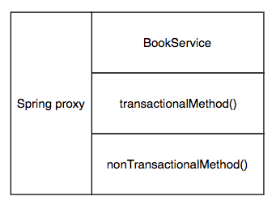
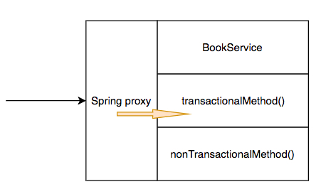
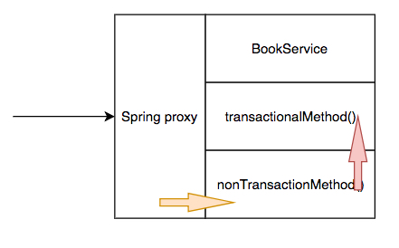

# To demonstrate the usage (gotcha) of spring @Transaction
There is a class `BookService`, with two methods, `transactionalMethod()` and `nonTransactionalMethod()`. `transactionalMethod()` annotated with `@Transactional`, whereas `nonTransactionalMethod()` is not. When `transactionalMethod()` is being invoked, the database queries happen within it will happen within a database transaction, meaning all database queries would be rolled back if exception happened, committed if everything is ok.

1. `BookServiceTest -> bookService -> transactionalMethod()`
2. `BookServiceTest -> bookService -> nonTransactionMethod() -> transactionMethod()`

And you think in the case 2 above, even though `nonTransactionalMethod()` is non-transactional, but it calls to `transactionalMethod()`, database queries should also be transaction-ied, but it is not. In case 2, none of the database queries is transaction-ied.

Reason being, let's say this is `BookService`

When it is being `@Autowired` it to another class eg: `BookServiceTest`, what's being kept in `BookServiceTest` is a proxied `BookService` like below:

When `BookServiceTest` calls `BookService`, it will first go to spring proxy, spring proxy finds `@Transactional` annotation in the method, then spring proxy will create the transaction, and commit/rollback the transaction when method exits.

Whereas when `transactionalMethod()` being called from `nonTransactionalMethod()`, because `transactionalMethod()` was not called within spring proxy (the red arrow), therefore `@Transactional` magic didn't happen. Like below:

